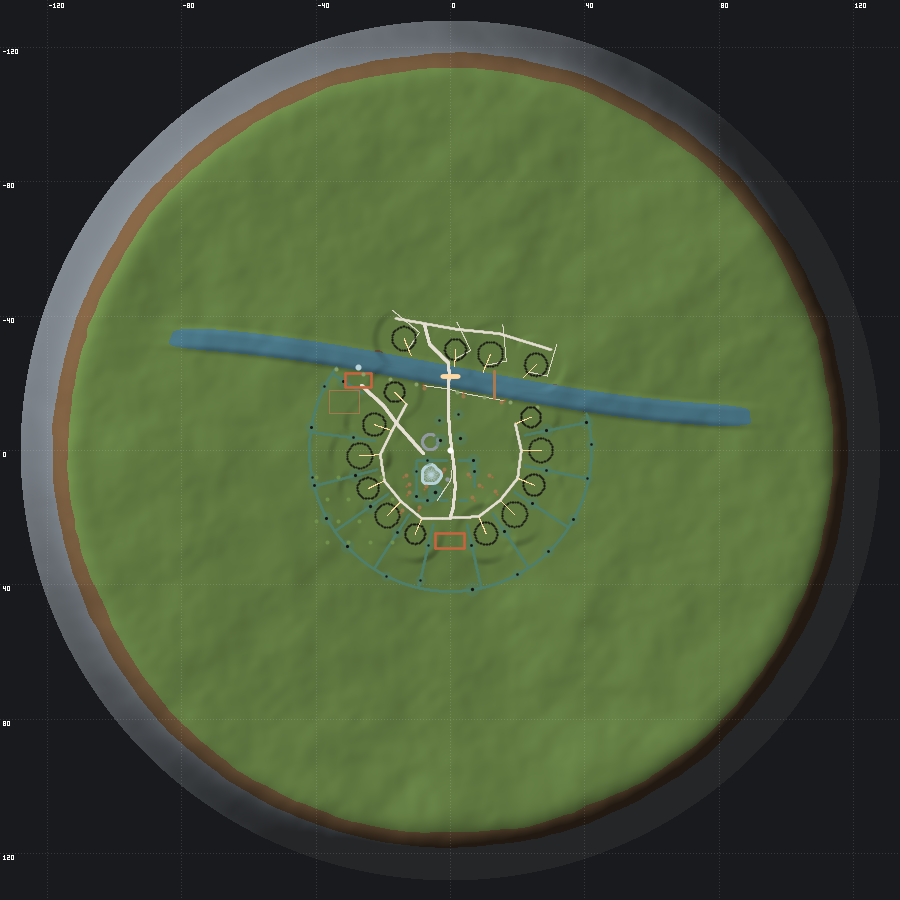
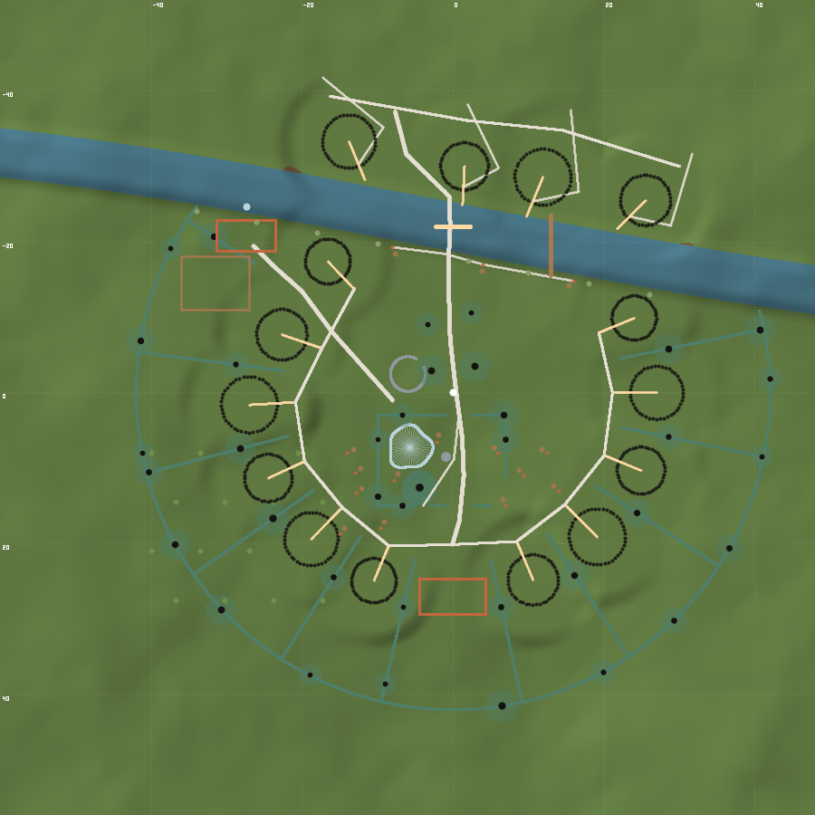

# Чертёж деревни

Рабочая документация к застройке долины. Составлена по реальной
английской деревне Уорикшира и Вустершира — тому ландшафту, который
Толкин называл образцом, — а не по его текстам и не по декорациям
фильмов. Ни одного имени собственного из легендариума здесь нет и быть
не должно: см. ограничение по названиям в CLAUDE.md.

Все координаты и уклоны перемерены по настоящему `heightfield.ts`.
Документ на английском: это спецификация, плотно набитая идентификаторами
кода. Скажете — переведу.

---

I have read the constitution and the four source files, and I re-derived every number in both layouts against the actual height field with a standalone replica of `heightfield.ts` (kept at `C:\Temp\claude\D--hobbits\03ad97d4-339a-46b5-bcab-b2a7ea2dcfd4\scratchpad\probe.mjs` — reusable, it imports nothing).

## Планы





Отрисованы по настоящему полю высот: холмы затенены тем же солнцем, что
светит в игре, серым показана полоса круче MAX_SLOPE — граница мира,
синим русло. Бирюзовое — живые изгороди, кремовое — дороги, красное —
постройки и рабочие точки, золотое — направления дверей и брод, белая
точка в центре — точка появления игрока. Сетка через 20 метров на
крупном плане и через 40 на общем.

Рисование окупилось немедленно: оно поймало две ошибки размещения,
которых текст не показывал, — угол мельницы в воде и переднюю дорогу,
проложенную по кургану. Обе поправлены ниже по тексту, обе помечены.

---

# THE VALLEY — ONE BLUEPRINT

## 0. What the measurements changed

Five findings that overrule one or both plans. All reproducible with the probe script.

| # | Claim | Measured | Consequence |
|---|---|---|---|
| 1 | Layout B: `yaw = 0` faces away from the village | **Confirmed.** Half-FOV at 16:9 is 42.8°. At `yaw=0` the view bearing is 180°; **zero** burrows in the cone. At `yaw=π`: burrow-3 6° off axis, burrow-4 32°, burrow-2 42°. | One line. Step 1. |
| 2 | A: mill needs weir + leat + pond + tailrace | **False, and unnecessary.** Bank freeboard along the whole channel is 0.16–0.46 m, so no weir above ~0.20 m is possible. But at `(-27.4, -24.6)` the natural bank profile already gives 0.29 m of standing water **1.4 m from the mill's south wall**. Undershot wheel, zero new hydrology. | Cut the entire waterworks. |
| 3 | A: back lane at r=40 is "0.7–5.5° the whole way" | **Half true.** r=40 west arc is 1–5°, but bearing 106° is 9° and 118° is 22°. Also r=40 is outside `TREE_CLEARING_RADIUS` 34 — it runs through woodland. | Croft rear hedge moves to **r=32** (inside the clearing, 0–12° over bearings 262→360→110). `TREE_CLEARING_RADIUS` is not touched. |
| 4 | Both: ridge and furrow at λ=5.0 m | Toon-band arithmetic **confirmed exactly**: sun elevation 50.24°, azimuth 56.3°, band edge needs an 8.43° flank, so A ≥ 0.24 m at λ=5. But λ=5 is only 5 samples per wavelength on a 1 m terrain mesh. | **λ = 6.0 m, A = 0.35 m.** Flank 10.38°, N·L 0.641 — stripes. 6 samples/wavelength. Back-scales to 9.3 m human — dead in the surveyed broad-rig band. |
| 5 | Both: hedge bank as a `heightfield.ts` term | 1.10 m base cannot be represented on 1 m quads (B admits this), and it would put ~500 segment tests inside `heightAt()`, which runs ~200k times at startup. | **The bank is ribbon geometry, not terrain.** The ribbon foot flares to 1.0 m × 0.18 m and follows the sampled ground. Player is stopped by obstacle circles, not slope. Zero heightfield cost. This is neither plan's answer and it is the right one. |

Also confirmed as-stated: the six burrow gaps are 35.8–38.8° (chords 17.1–18.4 m) with one 172.8° opening south, chord 50.22 m. That is a green-village ring and nothing moves.

**River direction.** The bed is a constant 0.75 m trench cut into a noisy floor, so it does not have a real gradient — but the trend from x=+70 (bed −0.13) to x=−50 (bed −2.21) is downhill west. Read the flow **east → west**. Mill goes west, ford stays east of it.

---

## 1. Scale rules — into `config/constants.ts` with this comment verbatim

```ts
/**
 * Vernacular dimensions are quoted for a 1.70 m adult and scaled to a
 * 1.1 m halfling. APPLIES TO: lane and gate widths, hedge and wall
 * heights, plot frontage, doors, steps, benches, bridge decks, wheel and
 * building dimensions. DOES NOT APPLY TO: orchard spacing, tree crowns,
 * river width, pond depth, hill slopes, and ANY ANGLE. A 50-degree roof
 * pitch is 50 degrees at every size; shrinking the pitch with the
 * building is what makes a small world read as a diorama.
 */
export const VERNACULAR_SCALE = 0.647;
/** Bay of a timber frame. Every above-ground structure is a whole number. */
export const BAY = 2.6;
```

Cart shed 1 bay, cottage 2, mill 3, inn 3.

---

## 2. The plan — measured coordinates

### 2.1 The green (the node)

Rounded rectangle, 2.5 m corner radius, **x ∈ [−10, +7], z ∈ [+3, +15]**. 17 × 12 m, 204 m².
Measured: h −0.46 to +0.18, range 0.64 m, max slope 6.8°. **No pad needed.**
Short dimension 12 m sits under the 13.8 m halfling-scale ceiling for a square that still reads as occupied. The current open middle is ~50 m.

Hedged W, N, S. Open on the east, where the cart lane forms the edge — which is how a real green meets its street.
- W hedge x = −10, z 3→15
- N hedge z = +15, x −10→+5
- S hedge z = +3, x −10→+7, with a **1.6 m foot gate** at x ∈ [−0.8, +0.8] and a **3.0 m lane crossing** at x ∈ [+4.0, +7.0]

Spawn (0, 0) is 3 m south of the foot gate. The player's first move is through a gate into a bounded room.

### 2.2 Green furniture

| Object | Position | h | Size |
|---|---|---|---|
| Standard oak | (−4.5, 12.5) | +0.11 | existing `treeGeometry()` at scale 1.55 → 8.4 m. 16.0 m from the load camera, 16° left of axis. Crown deliberately crops the frame top. |
| Wellhead | (−1.0, 8.5) | +0.02 | ring wall r 0.65/0.50 × 0.55 h; two 0.10 posts to 1.00; windlass barrel r 0.07 × 1.20; bucket. **Total 1.05 m — exactly halfling height, so it is the player's scale reference.** |
| Pond | **(−7.0, 4.5)** | −0.36 | Measured low corner of the green (rim range 0.31 m, slope 4.6°). Irregular 11-gon ~7 m across, dish 0.62 m below grade, water plane at −0.50 → **0.40 m deep**, lip 0.22 m proud. Reuses `River`'s material with `RIVER_WAVE_HEIGHT` 0.008 and `waterDepthAt()` unchanged. |
| Pound | (−8.5, 1.0) | −0.44 | 11 wall segments 1.30 × 0.95 × 0.30 on r 2.30 (4.6 m across), one 1.0 m gate NE toward the lane, 11 coping slabs on edge. ~200 tri. Verified range 0.17 m, slope 3.6°. |
| Benches | on the three relocated idler points | | existing `bench()` from `WorkSites.ts`, free |

#### As built

Four of the five positions in the table above were laid out before the
hedges, the hedgerow trees, the lanes and the footpath existed, and four
of the five landed inside one of them. Everything below was re-solved
against the world as it actually stands.

| | planned | built | why it moved |
|---|---|---|---|
| oak | (−4.5, 12.5) | **unchanged** | — |
| wellhead | (−1.0, 8.5) | **unchanged** | — |
| pond | (−7.0, 4.5), r 3.5 | **(−5.75, 7.25), r 2.8** | at r 3.5 the water ran 2.0 m past the green's south hedge and its centre was inside a hedgerow tree's crown |
| pound | (−8.5, 1.0) | **(−6.0, −2.5)** | 0.37 m from the mill lane's centreline — inside the road |
| benches | three idler points | **all three moved** | two seats stood in the cart road, one straddled the footpath |
| garden beds | five points | **four moved** | two overlapped the green's own hedges, one sat where the pond is, one was against the oak |

**The footpath is the furniture, and it was the path that had to bend.**
`green-walk` exists to run *south gate → well → oak → north gate*; three of
its four points were the gate, the well and the oak. Reading "the well sits
exactly on a path vertex" as a collision and shoving the well 1.7 m aside
would have left a beaten track from a gate to an empty patch of grass —
which is the defect that got `buildPaths()` deleted in the first place. The
props stayed; the polyline now passes 1.08 m from the wellhead (its track
edge 8 cm off the kerb, because the path leads *to* it) and 1.79 m from the
oak, against the 1.33 m the hedgerow-tree rule demands of any tree beside a
foot lane.

**The pond is a dug pond, not a dish.** The first profile curved from the
shoreline to the middle and held 9 m² — a puddle in a crater. A flat floor
with a 1.3 m bank ramp holds **15.3 m², 0.41 m deep**, and the bank stands
at 36°: past `GROUND_DIRT_SLOPE`, so the margin reads as poached mud, and
short of `VEGETATION_MAX_SLOPE`, so the grass above the waterline still
grows. Radius 2.8 is not taste — it is the largest circle leaving a body
room to walk between the water and every hedge, tree and lane around it.
The narrowest point of that walk is **1.48 m**, three player-widths.

**The waterline is not a circle anybody drew.** The dish is cut into the
height field; the water is a level plane; the terrain hides the plane
wherever it rises above it. What you see is the intersection of the two.
`POND_WATER_DEPTH` is 0.28 and not the blueprint's 0.22 because at 0.22 the
plane escaped the dish at ten vertices of the terrain mesh — a fine radial
scan said the rim held, and the mesh the BVH is built from said otherwise.

**Cost.** The pond's water is not a second surface: it is appended to the
river's ribbon with a per-vertex wave amplitude, so still water and running
water share one geometry, one material and one shader program. `River.ts`
is now `Water.ts`, because that is what it is. The furniture merges into a
shared `PropBatch` with the work-site props rather than merging per module:
**one new colour bucket, three draw calls, 816 triangles** — against the
fifteen calls it would have cost as a module of its own. `pondCarve` adds
**3.1 ms per pass, 12.4 ms of startup**, using a squared-distance early-out;
with `Math.hypot` there it was 29 ms.

Terrain invariants unchanged against the baseline: 0 rim leaks over 3,600
bearings, thinnest steep band 12.0 m, spawn ground −0.53 m.

### 2.3 Lanes — four classes replacing one

`PATH_WIDTH = 1.1` becomes half-widths, blend = 1.45 × half-width:

```ts
export const PATH_WIDTHS = { footpath: 0.35, croftPath: 0.5, frontLane: 0.8, cartLane: 1.0 };
```

**Cart lane** (bowed ~2.5 m over 32 m, so the destination arrives round a bend). All points measured ≤4.7° slope:
`(5.2, 21.0) → (5.0, 17.0) → (0.4, 15.0) → (0.9, 11.0) → (1.4, 6.0) → (0.6, 1.0) → (−0.2, −5.0) → (0.2, −11.0) → (0.0, −17.5) → ford → (0.0, −26.5)`
It passes **through** the green's east side and out the other side. It passes 0.9 m east of spawn: the player steps onto the road, not onto its centre.

**Front lane**, arc r = **20**, bearings 100° → 360° → 282°. Runs 2.8–6.3 m in front of the doors. Max slope 22.4° at the burrow-pad edges, comfortably under `MAX_SLOPE` 50°.

> Corrected from r = 21 after the plan was drawn. At 21 the arc passes
> **0.92 m** from burrow-1's mound — closer than half the lane's own width,
> so the lane would have run over it. At 20 the clearance is 1.92 m. At 22
> it would cut 0.08 m into the mound. The toft side hedges start from the
> same radius and move with it.

**Mill lane**, cart class. Measured 1.0–2.7° end to end:
`(−8.0, 0.0) → (−12.0, −3.0) → (−16.0, −6.5) → (−20.0, −10.5) → (−23.0, −14.5) → (−24.5, −17.5)`

**Footpaths** (0.35): foot gate (0, 3) → well (−1, 8.5) → oak (−4.5, 12.5) → north stile (−4, 15); and along the north bank linking the three fishing spots.

Delete `buildPaths()` entirely. Splines move to `src/config/lanes.ts` as data, so moving a lane is one file — the same discipline `work.ts` already has.

### 2.4 Boundaries — one primitive, five uses

Section (Midland single-brush, asymmetric so the two faces differ): foot 1.00 m wide, bank shoulder 0.18 m, crest **0.95 m** with deterministic 1D noise, period 3 m, amplitude 0.10 m. **1.13 m total.**
Camera check: at load, eye is feet + 1.32 m. It clears the hedge by 0.19 m. Above 1.13 m the frame greys out in every lane.

| Run | Geometry | Length |
|---|---|---|
| Green enclosure | above | 46 m |
| Croft rear arc | **r = 32**, bearings 262 → 360 → 110 (measured 0–12°; terminate before 115°, which is 24°) | 117 m |
| Six toft side hedges | radial r **20** → 32 on the bisectors: **13.0°, 50.9°, 88.0°, 125.0°, 259.0°, 298.5°, 335.8°** | 84 m |
| West + east closes | x ∈ [−17, −10] and [+11, +17], z ∈ [3, 15], gates at (−10, 8) and (+11, 9) | 52 m |
| Orchard enclosure | below | 88 m |

**Total 380 m.** As extruded ribbon at 0.5 m sampling: **~6,100 triangles**, merged into the 8 existing vegetation chunks, **no outline** (same reasoning as grass). Instanced as bushes it would be ~26,000.

Collision: ~540 circles of radius 0.5 at 0.7 m spacing, straight into `Obstacles.addToGrid` — the same grid that already bins 1,100 tree trunks. Gates are gaps in the chain, **1.6 m clear** (the surveyed 1.0 m minimum scales to 0.647 m, which with `PLAYER_RADIUS` 0.25 leaves 7 cm a side and jams the boom).

Five-bar gate: 1.97 × 0.71 m, 8 boxes, hung ajar at 35°. Step stile: posts 0.78 apart, rail 0.68, steps 0.19/0.39, 6 boxes.

#### As built

The table above was written for six dwellings and did not survive fifteen.
What shipped, measured in the running game:

| | planned | built |
|---|---|---|
| runs | 5 kinds | 17 |
| length | 380 m | 426 m |
| triangles | ~6,100 | 8,040 |
| blocking circles | ~540 | 415 |
| croft rear | r = 32 | **r = 42**, `TREE_CLEARING_RADIUS` 34 → 46 |
| toft sides | bisectors, r 20 → 32 | **gap midlines**, r 22.6 → 42 |
| gates | placed by hand | **derived from lane crossings** |

Three things the plan got wrong, each found by measurement:

- **The rear arc could not stay at r = 32.** With fifteen dwellings on a
  ring at r ≈ 27, a croft only 5 m deep is a flowerbed. It moved to 42 and
  the clearing radius moved with it — which *removes* trees rather than
  adding any, so it is free.
- **The bisector is not the midline.** With unequal mound radii the two
  differ, and the angular bisector came within 0.88 m of a mound — half of
  that is inside the hedge itself. Boundaries run down the middle of the
  gap instead, and clear every mound by 0.86 m.
- **Hand-placed gates go stale.** Three lanes were walled off the moment
  the boundaries went in, the cart road into the green among them. A gate
  is where a way crosses a hedge, so it is now derived from the two: five
  breaks, widest 3.0 m, and no lane blocked. Where the break landed at a
  run's *end* the boundary is trimmed instead — that means the way runs
  out of it rather than across it, as the mill lane does between two
  tofts, and gating it left an 8.8 m hole with a stub floating past it.

Each ring of the section is bedded into the ground under itself rather
than under the centre line. Sampling the centre left 125 of 1,708 feet
floating by up to 0.20 m: daylight under a hedge on every slope.

### 2.5 Hedgerow trees — the cheapest change in the document

Move ~34 of the existing 1,100 scattered trees onto the boundary polylines at 12–16 m spacing. Same geometry, same triangles, one extra `InstancedMesh`. A 5.4 m tree in the green's west hedge at 8.5 m gives a 1:1.6 enclosure ratio; the 1.13 m hedge alone gives 1:7.5 and encloses nothing. **The trees are what make the green a room.**

Placement: 2 on the green's W hedge, 2 on the N, 2 per close, 6 on the toft sides, 8 flanking the cart lane between z = −12 and +2, 12 on the croft rear arc. Placed explicitly, inside `TREE_CLEARING_RADIUS` — so the constant stays at 34.

#### As built

**36 trees, 2,304 triangles, one extra `InstancedMesh`.** Not moved off the
scattered 1,100 — walked along the boundaries, which is how a hedgerow
standard grows. 6 around the green, 4 down the cart lane, 26 in the croft
boundaries. Own seed (`HEDGEROW_SEED`), so they hold still when anything
upstream draws one more random number, and the plan in `docs/` can show
exactly where they stand.

Two numbers were wrong on the first pass, both caught by counting:

- **One interval does not fit both.** Thirteen metres is a hedgerow in a
  field and nothing at all around a green: it put two trees on forty-six
  metres of boundary. The green and the avenue are planted at half that,
  because they were planted on purpose and a field hedgerow was not.
- **Crowding is about crowns, not about the interval.** Measured against
  the interval, one tree a metre inside the green's north-west corner
  banned the next four metres of the hedge that turns there — the far
  side of the green, which is the side you look at. Two trees now conflict
  only when their crowns would interpenetrate, from a `TREE_CROWN_RADIUS`
  the geometry is built from and the planting reads back. Closest pair
  2.69 m, crowns just touching.

Filters: gateways (1 m either side — a gate under a tree is ordinary, a
tree *in* one is a gate that does not open), lanes by that tree's own
trunk plus a body, doors, mounds, water, slope, and the benches and beds
the villagers work at. Nearest lane edge clears by 1.36 m.

### 2.6 The inn — head of the green

**Centre (5.5, 23.4), long axis along x, front facing −z down the green.**
Measured corners: 0.04 / 0.36 / 0.36 / 0.04 — **range 0.35 m, slopes ≤2.0°**. Clearance 5.53 m to burrow-3's mound and 6.42 m to burrow-4's; it fills the 18.25 m chord between them and those two gaps become the yard entries. Sightline from the green centre is clear and it subtends **14.2°** — the largest thing in the frame.

3 bays × 2.6 = **7.8 × 4.2 m**. Plinth 8.0 × 0.30 × 4.4 (stone; it also hides the seam where a wall meets an analytic height field, so the pad need not be perfect). Eaves +1.90. Thatch at **50°** → rise 2.50 → **ridge +4.40 local, +4.79 absolute** — 0.2 m above burrow-3's crown, the tallest thing in the ring.
Thatch is a **shell**: 0.19 m of visible coat at the eaves, 0.19 m overhang, every arris rounded at 0.10 m. Ridge band 0.30 m either side, one step lighter than the coat.
Brick stack on the west gable to **+5.55**, 1.15 m clear of the ridge, wired in as a seventh plume in `Smoke`'s chimney array.
Door 1.00 × 0.95 with a 0.18 m lintel — villagers duck. Two mullioned lights 0.76 × 0.50, 0.06 m mullion as geometry, leaded quarries as texture. **Panel plane inset 0.03 m behind the frame** — that offset alone gives the toon shader a shadow line down every stud.
Frame is **box panels**, square, ~0.6 m; close studding only on the show gable facing the green.

### 2.7 The mill — no waterworks

**Building centred (−27.4, −20.8)**, axis along x, 3 bays × 2.6 = **7.8 × 4.0 m**, pad level −1.15 (measured range 0.39 m).

> Corrected after the plan was drawn. At the original −21.2 one sample of
> 364 across the footprint stood in water: the south-east corner reached
> z = −23.2 where the river's north edge is at −23.17, because the channel
> runs diagonally and rises towards the east. Moving 0.4 m north makes the
> whole footprint dry and still leaves the wheel only 1.8 m from the south
> wall. Water in the pit is unchanged at 0.29 m.
r = 34.3 — exactly on the tree-clearing edge, so it sits in the gap between clearing and wood, where a mill belongs. **39.3 m from the green centre = 25 s at walk.** Sightline from the green clear, subtends 6.7°.

Three storeys at 1.60 (above the 1.6 m burrow ceiling — this is a working building), eaves +4.80, gable 45° over 4.0 m adding 2.00, **ridge +6.80 above the pad**.

**Wheel pit (−27.4, −24.6).** Measured there: uncut ground −1.13, cut −1.72, carve 0.59 → **water surface −1.43, depth 0.29 m**. The mill's south wall is at z = −23.2, so the wheel is **1.4 m from the wall** — bridged by the wheel-pit side walls, not by a cut race. Nothing is added to `heightfield.ts` but the pad.

Wheel: 2.40 m diameter × 1.20 wide (Sarehole's 12 ft × 0.647), **24 flat float boards** 1.20 × 0.35 × 0.05 at 0.314 pitch, 12 spokes, two rims at r 1.15 and 1.18. Immersion 0.29 m. Axle y = −0.58; **crown +0.62, standing 1.77 m above the mill floor.** 6.5 rpm, one turn per 9.2 s — spokes phase-offset from paddles and the two rims at different radii, or a toon silhouette with no motion blur is perfectly periodic and reads as a wagon-wheel wobble.

**Lucam** — the one feature that reads "mill" and nothing else: gabled weatherboarded hood projecting 0.90 m, 1.10 wide, own gable 0.60, on two knees; loading doors 1.30 × 1.10 at +2.00; hoist beam 0.12 sq projecting 0.30, rope and hook hanging 0.80. ~20 boxes, worth more than the rest of the building.

Spray at the wheel foot: `Smoke` unchanged, white, 8 puffs, 0.8 s lifetime, no drift. Millstone as door threshold: one cylinder r 0.40 × 0.16.

Mill yard **(−23.5, −18.5)**, 9 × 7, range 0.31 m.

### 2.8 The crossing

**Ford** on the cart lane at x ∈ [−2.25, +2.25], channel centre z = −22.00 exactly. Measured: bed −1.24, water −0.79, north bank top (z=−17.5) −0.41, south (z=−26.5) −0.51, bank slope 18.0°.
12 stone setts 0.90 × 0.70 × 0.10, laid flush, ≤0.06 m proud. Both approaches regraded to **4.5 m ramps at 7%**, splaying 6.0 m at the top to 4.5 m at the water. The two pale splayed triangles are what make a ford legible from twenty metres; the water is not. Four squared marker posts 0.12 sq × 0.90 at (±2.6, −18.2) and (±2.6, −25.8). No striped depth gauge — that is a modern highway object.

**Plank footbridge at x = +13**, channel centre −19.52, deck z −15.5 → −23.5. Span 8.0 m, **deck 1.10 m** (two halflings abreast at `PLAYER_RADIUS` 0.25, so passing an NPC is a real negotiation), humped 0.45 m, two beams 0.26 × 0.20, 11 planks, one pair of mid-piles, **handrail on the upstream side only** — documented asymmetry, and it is what stops a procedural asset looking generated.
Detour is 26 m ≈ **16 s** against ~4 s of wading. So the bridge is the *dry* option, not the fast one. `WADE_SPEED` keeps its meaning. Placing it east also balances the mill in the west.

### 2.9 Orchard — the one thing built at true size

4 × 4 quincunx, **pitch 6.5 m, unscaled** (a damson is a damson whoever picks it), deterministic jitter ±1.0 m.
Origin x₀ = −40, z₀ = +8, alternate rows offset 3.25. **Fourteen of sixteen nodes verified clear** (slopes 0–9°); drop `(−27.0, 8.0)` and `(−20.5, 21.0)`, which hit burrow-1's and burrow-2's mounds. An orchard with two gaps around obstacles is what an orchard looks like.
Tree variant: existing `treeGeometry()` with the trunk cut from 2.30 to 1.20 m (a bare standard, grazed beneath), one crown ball at r 1.7 squashed to 0.75, whole thing at scale 0.9 → ~3.3 m. Every fourth tinted 25 % toward `PALETTE.bloom`.
Hedged all four sides, 1.2 m gate east. Grass inside at `GRASS_HEIGHT × 0.5`, bushes suppressed, scattered trees suppressed in x ∈ [−46, −16], z ∈ [4, 32] — the block straddles r=34 and would otherwise fill with woodland.

### 2.10 Chimney stacks — three lines, reads at 80 m

`build.ts` currently makes a 0.6 m cylinder centred 0.15 m **below** the crown, so 0.15 m of pipe shows and the working smoke vents from nothing. Replace with a **0.30 × 0.30 square brick stack** rising 1.00 m clear of the crown (the 1.83 m spark-dispersal rule × 0.647 = 1.18; trimmed so it does not read as a factory), plus a 0.40 × 0.40 × 0.12 cap. Square, not round: a cylinder reads as a pipe, a box reads as built.
Measured tops move from 2.34–3.91 m to **3.19–4.76 m**. Burrow-3's, at the head of the green 27 m from the load camera, subtends 9.0°. The `chimneys` array already feeds `Smoke.ts`; nothing else changes. **Zero new draw calls** — merged into the existing part meshes.

### 2.11 Riverside pollards

Eight on the **north bank only**, x ∈ {−34, −26, −18, −10, +2, +10, +18, +26}, each at z = `riverCenterZ(x)` + 4.2. Skips x = 0 so the ford has a clear frame. Sits directly behind the three unchanged fishing points.
Bolling 1.50 m, trunk r 0.26 tapering **up** to 0.34 at the head (a pollard is fatter at the top — that is the silhouette), icosahedron head r 0.36, 12 cones r 0.03 × 1.20 fanned. Total 2.9 m, ~200 tri each. One merged mesh + outline.

### 2.12 Ridge and furrow — last, and conditional

Two blocks only, both measured:

| Block | Centre | Size | Range | Max slope |
|---|---|---|---|---|
| East croft | (28, 14) | 7 × 8 | 0.16 m | 5.0° |
| North croft | (0, 29) | 12 × 7 | 0.51 m | 14.9° |

`h += (A/2)·cos(2π·u/λ)` with **λ = 6.0 m, A = 0.35 m**. Flank 10.38°, N·L 0.641 toward / 0.877 away → the flanks land in different toon bands and the field stripes. Max slope is irrelevant to `MAX_SLOPE` 50° and `STEP_HEIGHT` 0.15.
Ridge azimuth snapped to **36.87° (3-4-5)** relative to the terrain grid so the 1 m sampling phase repeats instead of drifting along the ridge — drifting phase is visible rippling and reads as a bug, not a feature.
Reversed-S: `s = 2v/L − 1`, phase offset `A_S·s³` with A_S = 6.0. The cube is flat through the middle and swings the two ends in *opposite* directions.
Headland: taper A to zero over 4.5 m at each block end and add a 0.12 m rise.
**Keep hedge orientation independent of ridge azimuth.** Hedges crossing ridges obliquely is the actual signature of the surviving landscape, and it is one line of *not* coupling two variables.

**Acceptance gate:** build it, walk the block, and if the ridges ripple in height along their own length, raise λ to 7.0 / A to 0.41 (7 samples per wavelength) before touching `VALLEY_SEGMENTS`.

---

## 3. Terrain changes — three analytic terms, not eight

Applied in `valleyFloor()` in this order: rim + hills + detail → ridge and furrow → lane carve; then pads, then `riverCarve` in `heightAt` as now. **Pads must win over the lane trough** or a lane eats a burrow threshold. Every term early-outs on a bounding circle.

1. **`laneCarve(x, z)`** — the `riverCarve` pattern with different constants, reading the same splines as `groundColor`. 0.30 m on the front lane and inside the green, **0.55 m on the cart lane from z = −4 to −18**, 0.35 m on the mill lane, zero on footpaths. Floor never narrower than **2.6 m** and never deeper than **0.6 m** — both set by `CAMERA_COLLISION_MIN` 0.6 against a 3.0 m boom, not by taste. Shoulders 1.0 m → 29°, **deliberately under `MAX_SLOPE`**: being unable to climb out of a lane is miserable in a walking game. Containing the player is the hedge's job. Taper to zero 4 m before the water and long before the rim.
2. **`pondDish(x, z)`** — smoothstep bowl at (−7.0, 4.5), 7 m across, 0.62 m below grade, 1.2 m rim blend.
3. **`ridgeAndFurrow(x, z)`** — masked to the two polygons above.

Plus **four pads** via `padWeight()` from `burrow/profile.ts`, exactly as `burrowGround` already does: inn (5.5, 23.4) level +0.20; mill (−27.4, −21.2) level −1.15; mill yard (−23.5, −18.5); pound (−8.5, 1.0).
Plus **ford ramps** masked to |x| < 3.2 on the ford line only.

**Not changed:** `riverCenterZ` (a second meander term would invalidate the three fisher points, the `River` ribbon, `groundColor`'s bank term and the documented 3,600-direction rim closedness test — for landforms that read as noise at this scale). No hedge bank in the field. No mill pond, leat, weir, tailrace or race. No mesh refinement. `VALLEY_SEGMENTS` stays 256.

---

## 4. Moved, changed, removed

**Nothing is deleted from the world. `config/burrows.ts` is not touched.** Not a coordinate, not a radius. The 172.8° southern gap is the composition, not a defect.

**`src/config/work.ts` — all measured, slopes 1.1–4.1°, props verified inside r = 19 so nothing lands on the front lane.**

| id | from | to | why |
|---|---|---|---|
| garden-1..5 | (−8,10) (−11.5,13) (−5,14.5) (−14,8) (−9,17) | **(−12.2, 5.4) (−14.6, 8.2) (−12.0, 10.8) (−14.8, 13.0) (−11.4, 14.6)** | They currently stand *in the middle of the green*. Now a hedged west close, visible from the green through its gate. |
| saw-1..3 | (9,11) (12.5,8) (7,15) | **(12.4, 5.8) (14.6, 9.6) (12.0, 13.2)** | East close, a wood yard. Also drops the cluster from an even 4 to an odd 3. |
| saw-4 | (14,13) | **(−24.2, −17.4)** | The mill yard. The `miller` role finally has a mill. |
| square-1..3 | (0,9) (3.5,12) (−3.5,11) | **(−2.4, 10.4) (−5.0, 5.6) (2.2, 7.4)** | Onto the well, the pond and the green's south end. Their benches come free from the same data. |
| river-1..3 | — | **unchanged** | `riverCenterZ` is not being touched, so the file's own warning does not fire. Pollards go behind them. |

**Removed:** `groundColor.buildPaths()` — ten dead-straight segments radiating from (0, 0). No path joins two burrows, none crosses the river, none loops, and every one terminates at an empty point, which tells the player the centre is a destination when nothing is there.

**Constants:** `CameraRig.yaw = 0` → `Math.PI`. `PATH_WIDTH`/`PATH_BLEND` → `PATH_WIDTHS`. Add `VERNACULAR_SCALE`, `BAY`. `TREE_CLEARING_RADIUS` **unchanged at 34**.

**Palette — three additions, no removals:**
```ts
timber:    0x9a9185,  // silvered weathered oak
limeOchre: 0xd9bd85,  // second panel wash, varied per building from the seed
sandstone: 0xb08163,  // warm cut stone: chimneys, ford setts, mill plinth
```
Keep `rock: 0x9098a0` for what it is right for — the pound, the wheel pit, stepping stones. **Do not use `ink` for frame timbers.** Black-and-white framing is a 19th-century revival (unpainted oak silvers to grey), and at `TOON_STEPS` 3 a near-black member eats the shadow band and fights the shader.

---

## 5. File structure

```
src/config/
  lanes.ts        NEW  ~70   lane splines + width class, data only
  hedges.ts       NEW  ~90   boundary polylines + gate positions, data only
  constants.ts    EDIT       PATH_WIDTHS, VERNACULAR_SCALE, BAY
  palette.ts      EDIT       +3 tokens
  work.ts         EDIT       12 coordinates
src/world/
  Hedges.ts       NEW  ~230  Catmull-Rom -> extruded ribbon, per chunk; gates; obstacle circles
  GreenFurniture.ts NEW ~160 well, pond, pound, benches, standard oak
  buildings/
    frame.ts      NEW  ~300  timberBuilding(bays, depth, pitch, opts) -- inn AND mill
    mill.ts       NEW  ~200  lucam, wheel, wheel pit
    inn.ts        NEW  ~40   parameters only
  Crossing.ts     NEW  ~130  ford setts, ramps, marker posts, footbridge
  Pollards.ts     NEW  ~90
  Orchard.ts      NEW  ~80
  heightfield.ts  EDIT ~130  laneCarve, pondDish, ridgeAndFurrow, four pads
  groundColor.ts  EDIT ~90   rewrite buildPaths -> route table; sward, croft, dripline terms
  Vegetation.ts   EDIT ~50   hedgerow-tree pass, suppression rects, grazed floor
  burrow/build.ts EDIT ~10   chimney stacks
src/render/
  CameraRig.ts    EDIT   1   yaw
```

**Budget: +47 draw calls, ~14,000 triangles.** Against a 131k-triangle terrain and ~40 vegetation chunks. The expense is authoring time, not frame time.

---

## 6. Build order — every step ships

**Step 1, before anything else: `CameraRig.ts` line 45, `yaw = 0` → `Math.PI`.**
One character of real work. Without it the player currently loads facing an empty field with the entire village behind them, and *every* item below is invisible on arrival. It is also the only step that improves the game as it stands today, with no new geometry at all. Do it, look at the screen, then continue.

| # | Step | Ships as | Why here |
|---|---|---|---|
| 1 | Camera yaw | The village is on screen at load | Prerequisite for judging everything after |
| 2 | Chimney stacks + `work.ts` relocation | Six tall verticals in a landscape of domes; the green's middle empties of diggers | Two data edits. Clears the ground the green needs, and pays off `Smoke` immediately. |
| 3 | Lane hierarchy: `lanes.ts` + `groundColor` rewrite | Four road widths, a spine through the green, the star gone | Pure vertex colour. Zero geometry, zero draw calls. Establishes the plan on the ground before anything is built on it. |
| 4 | **`Hedges.ts` + green enclosure + gates** | **The green becomes a room** | The single highest-leverage element. One primitive that steps 5, 8 and 11 all reuse. |
| 5 | Toft sides, closes, croft rear arc, hedgerow trees | Every plot is owned; enclosure ratio goes from 1:7.5 to 1:1.6 | Data + one InstancedMesh. Trees in a line say someone owns this. |
| 6 | Green furniture: oak, well, pond, pound, benches | A node with communal kit, 8.5 m from spawn | First still water. Cheapest expensive-looking thing a toon renderer has. |
| 7 | `frame.ts` + the inn | The green acquires a head; first rectilinear silhouette | Builds the reusable bay module. 14.2° in frame from the green centre. |
| 8 | The mill | The far landmark and the only moving mechanism in the world | Reuses `frame.ts`. No hydrology — see §2.7. |
| 9 | Ford paving + footbridge | The river becomes a node instead of an edge; the crossing becomes a choice | Small, and it protects the wade mechanic instead of undoing it |
| 10 | Orchard + pollards | A grid in a landscape of noise; a managed bank | Two instanced passes |
| 11 | Hollow lanes | The routes read as centuries old | Terrain only. Do it late so the splines are settled. |
| 12 | Ridge and furrow | Two ploughed blocks | Conditional — see the acceptance gate in §2.12 |

---

## 7. Cut, with the reason

- **The mill's weir, leat, millpond, bay, spillway, tailrace and race.** Measured: bank freeboard is 0.16–0.46 m, so no weir above 0.20 m is buildable; and water already stands 1.4 m from the mill wall. A 24 m leat is a real 130–200 m compressed sixfold; at this scale it is a ditch and a puddle for a whole new hydrology module. The pond goes on the green instead, 8 m from spawn, where the player is standing.
- **A closed back lane at r = 40.** Outside `TREE_CLEARING_RADIUS`, one 22° pinch, and it would force a clearing-radius change that thins the wood the valley's silhouette depends on. The croft rear arc at r = 32 does the same job inside the clearing.
- **The 0.78 m Devon hedge bank in the height field.** Unrepresentable on 1 m quads, and 0.78 + 0.87 = 1.65 m of green would black out the frame at a 1.32 m eye. Bank is 0.18 m of ribbon geometry.
- **Rebuilding the six burrow frontages** (retaining wall, segmental arch, mullioned lights). Correct and locally precedented, but it rewrites six working meshes and buys nothing at 23–26 m, which is as close as the player ever gets to five of the six. The chimneys deliver more silhouette for 10 lines. Revisit after step 12.
- **Stakes at 0.29 m, hazel binders, wattle staves at 0.13 m, lead cames at 6 mm, brick courses at 35 mm, cock-and-hen coping.** All correctly researched, all sub-pixel at the distance the player sees them, all flattened by a three-step ramp. Keep the brick-course *number* for the chimney texture; build none of the rest as geometry.
- **A second meander term on the river.** Invalidates four systems and the rim closedness test for landforms that read as noise.
- **Sheepwash, eel bucks, granary on staddle stones, washing stage, watering hard, ha-ha, clapper bridge, stepping stones, dry-stone field walls, jetty.** Every one real; every one under 0.9 m or beyond r = 44. This is clay country — walling the fields would relocate the valley to the wrong county. Two props survive (pound, per-toft yard clutter seeded from the burrow id) because two props read as habitation and fifteen read as an asset dump.
- **The smithy.** Deferred, not refused: (10.0, −2.5) is measured flat (range 0.16 m, slope 2.2°, 11.7 m clear of burrow-6 — proper fire clearance next to thatch). It is a seventh function and a fourth building. Build it only if steps 1–12 land and the valley still wants one.
- **Adding or moving a burrow.** The frontage problem is occupancy (mound covers 40 % of an 18 m chord against a surveyed 50–67 %), not spacing. Hedges and yard clutter take it to ~60 % with no new dwellings.

**Constitution check.** Circuit of the finished plan — green, front lane, croft rear, mill lane and back, orchard — measures ~400 m = **250 s at `WALK_SPEED`**, before any hedge detour; a straight crossing is 160 s today. The valley is currently *under* its own five-minute specification and enclosure closes the gap without one extra metre of terrain. Every prop above is boxes, cylinders, cones and extruded prisms. No character is added or generated. One palette, three tokens added, none replaced. Every generator is seeded through the existing `hashSeed`/`makeRandom`; there is no `Math.random` anywhere in the plan.